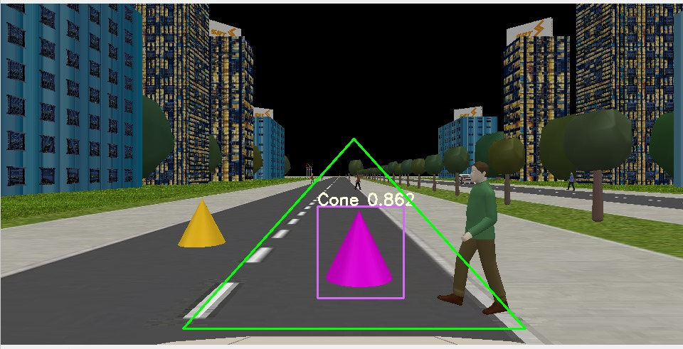

# Lane Detection with YOLOv7 
## 📌 Project Overview
This project combines YOLOv7 (for object detection) and computer vision techniques to detect lanes, pedestrians, and vehicles in real-time. It supports multiple track shapes (circular, custom paths) and includes Region of Interest (ROI) filtering for optimized processing.  

Key Features  
✔ Lane Detection – Using perspective transforms, binarization, and sliding window techniques.  
✔ Object Detection – YOLOv7 detects pedestrians and vehicles within lanes.  
✔ Multiple Track Support – Pre-configured launch files for different track shapes (circular, custom, etc.).  
✔ ROI Filtering – Focuses processing only on relevant road regions.  
✔ ROS Integration – Works with Robot Operating System for real-time control.  

## 📂 Project Structure
LaneDetection/  
├── Lane detection/       
├── src/                 
├── launch/                
├── config/                  
└── weights/                

## 🎯 Results
- Lane Detection: Works on curved and straight lanes.

- People/Vehicle Detection: YOLOv7 identifies obstacles.

- Multi-Track Support: Switch between different road layouts.
